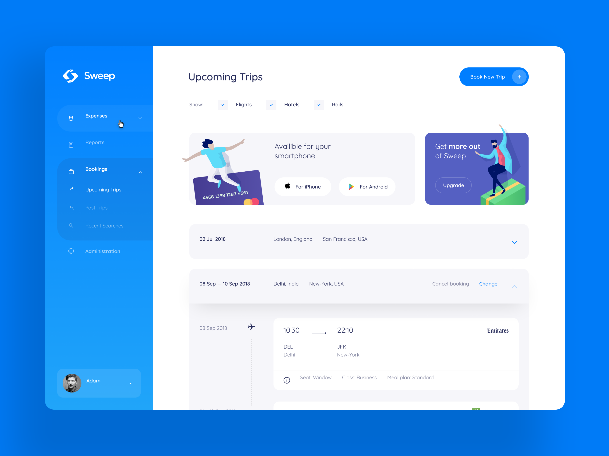

### Sweep Travel WebApplication
## Used Libararies :
<ul> 
<li>React</li>
<li>React-Native </li>
<li>React-Native-Web</li>
<li>Redux</li>
<li>React-Art</li>

<i>-->Note : No Other Third Party Library Used</i>

</ul>

This project was bootstrapped with [Create React App](https://github.com/facebook/create-react-app).

## Available Scripts

In the project directory, you can run:

### `npm start`

Runs the app in the development mode. 
Open [http://localhost:3000](http://localhost:3000) to view it in the browser.

The page will reload if you make edits. 
You will also see any lint errors in the console.

